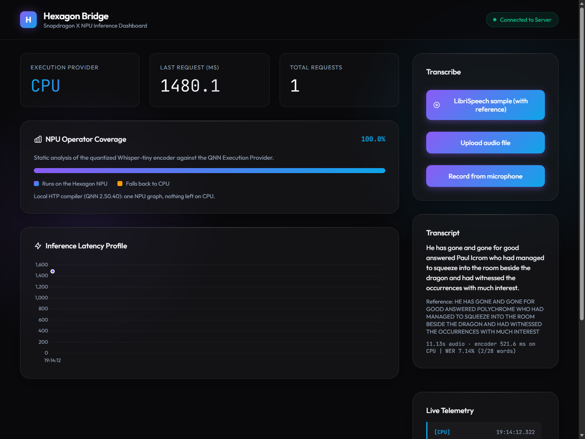
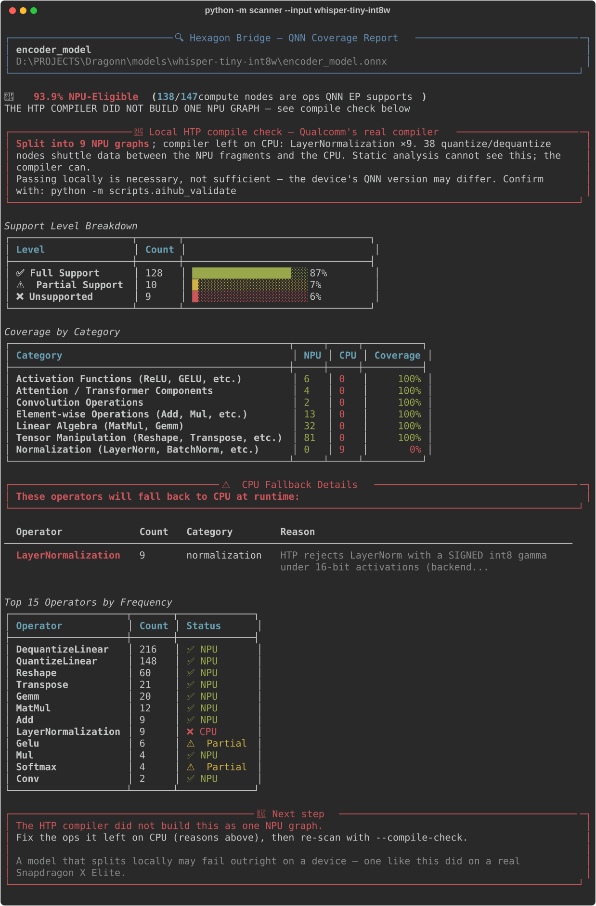
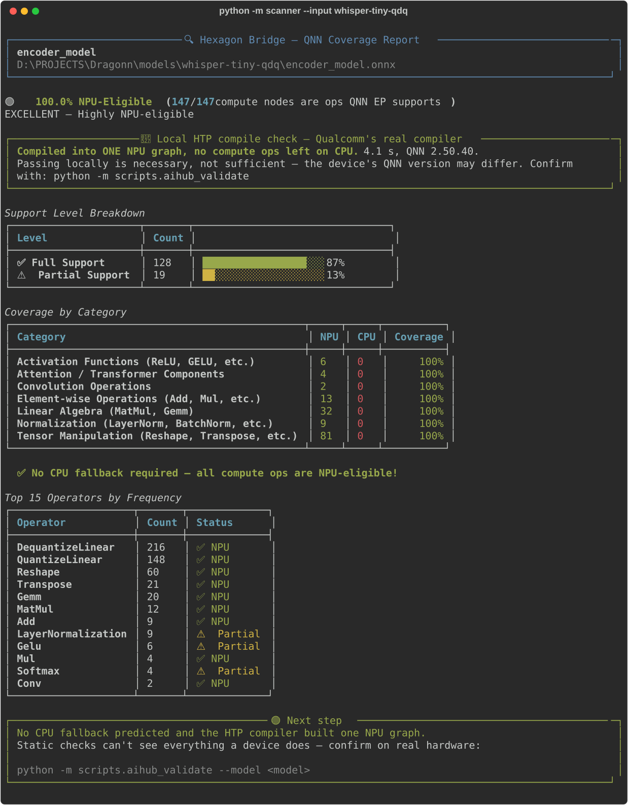

# 🐉 Project Dragonn — "Hexagon Bridge"

[](https://github.com/RishiMaara/Dragonn/actions/workflows/tests.yml)
[](LICENSE)

> **Know whether your model will actually touch the Hexagon NPU — before you ship it, not after the battery dies.**

Hexagon Bridge is a pre-flight check, conversion pipeline and real-hardware
validation harness for running models on the Hexagon NPU in Snapdragon X PCs. It
exports, quantizes the *QNN-specific* way, and — the part nobody else does — tells
you the truth about what will run on the NPU and what will silently fall back to CPU.

**Scope, precisely:** the scanner, the local HTP compile check and the AI Hub
validation work on any ONNX model. The full export → quantize → validate path is
proven end to end on a real Snapdragon X Elite for **whisper-tiny's encoder**, and
run across **five more popular models** — MobileNetV2, Whisper-base, MiniLM,
DistilBERT and CLIP — each profiled on the same device
([model zoo](models/reports/zoo/README.md)).

## Results at a glance

Measured on a real **Snapdragon X Elite** (Qualcomm AI Hub, QNN SDK 2.45) — every
number links to its job in [Results](#results):

| | |
|---|---|
| **Runs on the NPU** | 185 of 187 layers on the Hexagon NPU; the other 2 are the float↔int conversions at the graph edges, on CPU by design |
| **Speed** | **17.8 ms** median encoder latency — **57x** faster than FP32 on the same device's CPU by AI Hub's numbers; **4–10x** against a well-tuned CPU (see caveats) |
| **The silent fallback** | A quantized model that misses the NPU runs **26–28% slower than not quantizing at all** — measured in two separate sessions |
| **Accuracy** | Quantized encoder on CPU: **12.70% WER = the FP32 reference**. On the NPU: 14.07% (+1.37, not statistically significant at this sample size) |
| **Catches the failures** | The scanner flags the exact model a real X Elite rejected — statically, and by running Qualcomm's HTP compiler locally in ~4 s |
| **Cold start** | Compiled NPU graph cached: session start 3.3 s → 0.1 s (device: 5.2 s cold vs 0.5 s warm) |
| **Not one model** | Five more models — MobileNetV2, Whisper-base, MiniLM, DistilBERT, CLIP — converted and profiled on the same X Elite. MobileNetV2's naive build places perfectly on the NPU and answers **7.2%** correct; this pipeline's build answers **79.5%**, matching FP32 |
| **Against the vendor** | Qualcomm's own NPU Whisper-tiny encoder on this device: 25.0 ms. This pipeline's: **17.8 ms**. Their decoder — the piece this project doesn't yet run — is 2.60 ms/token, 509/509 layers on NPU |

**Evidence anyone can open:** the AI Hub job links below only work for the account
owner, so every result — including the X Elite's own log of rejecting the broken
model — is committed in [`models/reports/`](models/reports/README.md), indexed claim
by claim.



*The dashboard mid-transcription. Captured on the x64 development PC, so the
encoder ran on CPU — and the dashboard says so. It reports the provider the
session actually attached, never the one requested.*

---

## The Problem

A Snapdragon X Elite / X Plus laptop ships with a Hexagon NPU rated at 45 TOPS
(80 on X2 Elite). For any model that isn't already sitting in a vendor catalog,
that NPU is effectively unreachable — not because the silicon can't run the model,
but because the path from *"checkpoint on HuggingFace"* to *"graph the Hexagon
NPU will accept"* is a specialist pipeline with **silent** failure modes.

Three things break, in order of how much they hurt:

**1. The curated catalogs only cover what's already in them.**
Qualcomm AI Hub and the Windows ML / Foundry Local model catalogs ship
pre-converted, pre-quantized models that do run on the NPU. Step one inch outside
that list — a domain fine-tune, a newer checkpoint, a model nobody at Qualcomm
prioritized — and there is no supported path. You are on your own.

**2. The local-inference stacks people actually use don't target QNN.**
llama.cpp, Ollama and LM Studio load GGUF and execute on CPU (and increasingly
Adreno GPU). Hexagon backend work exists but is recent and partial. So the default
experience on a 45 TOPS machine is: NPU at 0%, CPU pinned, fans up, battery down.

**3. The DIY path fails silently, not loudly. ← this is the one that matters**

If you quantize an ONNX model the *conventional* way and hand it to ONNX Runtime
with QNN EP enabled:

- the session **loads successfully**
- inference **returns correct outputs**
- no exception, no warning, no error code
- and **every single node runs on CPU**

The NPU was never touched. Nothing told you. And it's worse than "no speedup": on a
real X Elite, the quantized model running on CPU was **26–28% slower than the
unquantized original**, because every quantize/dequantize pair becomes CPU work.

### This project's own first output was the proof

The first version of this pipeline ran without error and reported success. What
its quantizer actually emitted:

```
DynamicQuantizeLinear ×2      ← dynamic quantization
ConvInteger           ×1      ← QNN EP has no builder for this
MatMulInteger         ×1      ← QNN EP has no builder for this
QuantizeLinear/DequantizeLinear ×0   ← no QDQ node units at all
```

QNN EP consumes **QDQ node units**; it has no support for the dynamic-quantization
op family. That model would have loaded on a Snapdragon, produced correct
transcripts, and run **100% on CPU**. Meanwhile the scanner graded it **"85.0%
NPU-eligible"**, because its registry marked `MatMulInteger` as supported. Two green
numbers, both wrong, pointing the same wrong direction.

**Conversion isn't hard. It's deceptive.**

---

## The traps, stacked

Fixing one exposed the next. Each one passes every check before it.

### Trap 0 — "then don't quantize"

The obvious escape: the HTP runs float graphs as FP16, and ONNX Runtime converts
them for you (`enable_htp_fp16_precision`, on by default). The unquantized
whisper-tiny encoder does compile into a single NPU graph locally, and ONNX
Runtime's own strict mode accepts it.

It then failed on a real X Elite — `Failed to finalize QNN graph`, error 6000 —
and again on a second device
([evidence](models/reports/aihub_fp32_on_htp_FAILED.json),
[device log](models/reports/device_logs/jg9zk7ywp_FAILED_fp32-as-fp16.log)). The
local compiler ships QNN 2.50; that device runs 2.45. Qualcomm's own float
Whisper avoids this by being compiled ahead of time for the chipset instead of
converted at load. So a local pass outranks a static scan, and only the device
outranks a local pass.

### Trap 1 — the wrong format: unpredictable placement, reliably worse answers

`quantize_dynamic()` is the recipe most tutorials show. It computes activation
ranges at runtime, which is not what QNN EP's QDQ path consumes — and the
consequences turn out to depend on the model, which is worse than a clean
failure. Measured on a real X Elite, one model per row
([zoo evidence](models/reports/zoo/README.md)):

| Naively quantized model | What the chip did | What it cost |
|---|---|---|
| CLIP ViT-B/32 vision | ran **fully on the NPU** — 450/450 layers, 3.06 ms | nothing measurable |
| MiniLM-L6 | ran on the NPU — 232/234 layers, 1.09 ms | same top search hit: 100% → **63.3%** |
| MobileNetV2 | one NPU graph, nothing on CPU | top-1: 79.5% → **7.2%** |
| whisper-base | **crashed the device runtime** — access violation; locally the compiler had left `ConvInteger` ×2 and `DynamicQuantizeLinear` ×2 on CPU | WER 8.84% → **11.33%**, when it runs at all |

So this format does not reliably cost you the NPU. It reliably costs you
accuracy, and what the compiler does with it varies by model and SDK version —
which is exactly why a scanner that only counts ops isn't enough, and why this
one also runs the compiler and reconciles against a device.

**This corrected an earlier claim of my own.** The scanner used to report
"0% NPU — QNN EP will claim none of this graph" for these models. The device
disagreed, so the wording changed. Fix either way: static QDQ via ORT's QNN
config helpers, which matched FP32 accuracy on four of the five models here.

### Trap 2 — the right format at the wrong precision: 100% NPU, wrong answers

Same graph, same real-speech calibration, 57 held-out LibriSpeech clips — only the
activation precision differs ([evidence](models/reports/wer_calibration_and_precision.json)):

| Activation precision | Encoder cosine vs FP32 | Word error rate | Verdict |
|---|---|---|---|
| 8-bit (`a8w8`) | **0.521** | **93.5%** — 751 of 803 words wrong | structurally perfect, useless |
| 16-bit (`a16w8`) | **0.994** | **12.70%** — identical to FP32 | shipped |

The 8-bit model scans 100% NPU-eligible and compiles to one NPU graph. It just
transcribes gibberish. This encoder's activations span roughly [-18, 18]; 256
levels cannot carry that through nine LayerNorms.

### Trap 3 — only the chip knows

The a16w8 model then scanned 100% NPU-eligible, measured cosine 0.99 locally, and
**failed on a real Snapdragon X Elite**: `Failed to finalize QNN graph` (errors 6000 /
1002). The device log showed why — the HTP backend rejected all 9 LayerNorms
(`backendValidateOpConfig ... error 3110`) because their gamma was quantized as
*signed* int8. The op is supported, the format is right, the precision is right:
one sign bit on one input of one op type.

Unsigned uint8 weights compiled the entire encoder as a single NPU graph and passed
on the device. A second fix rode along: running ORT's generic preprocessing before
the QNN one left 6 bare `Erf` nodes (rejected by HTP, each splitting the graph)
instead of fusing them into a native `Gelu`.

**The scanner now catches trap 3 two ways**, both verified against the model the
chip rejected:

| Model | Static check | Local HTP compiler (`--compile-check`) |
|---|---|---|
| int8 weights — **failed on the X Elite** ([device log](models/reports/device_logs/j57edm49p_FAILED_int8-weights.log)) | 🟡 SPLIT: LayerNorm ×9 rejected (93.9%) | 🔴 Split into 9 NPU graphs, LayerNorm ×9 on CPU |
| uint8 weights — **passed on the X Elite** ([device log](models/reports/device_logs/jpxlee83p_PASSED_shipped-model.log)) | 🟢 100% | 🟢 One NPU graph, 4 s |

<table>
<tr>
<td width="50%" valign="top"><b>The model the X Elite rejected</b><br></td>
<td width="50%" valign="top"><b>The shipped model</b><br></td>
</tr>
</table>

---

## What "suitable for Snapdragon PCs" actually requires

| # | Constraint | Why | Naive path violates it? |
|---|---|---|---|
| 1 | **Static** QDQ quantization | HTP is fixed-point; it fuses `DequantizeLinear → Op → QuantizeLinear` node units | ✅ `quantize_dynamic()` emits ops QNN can't build |
| 2 | **uint16 activations**, **unsigned** uint8 weights ("a16w8") | 8-bit activations: 93.5% word error rate. Signed int8 gamma: LayerNorm rejected on silicon | ✅ `activation_type=QInt8`; "int8 weights" |
| 3 | **Static input shapes** | HTP compiles a fixed graph; symbolic dims can't be resolved | ✅ exporters default to dynamic axes |
| 4 | **ARM64-native Python** | `QnnHtp.dll` is ARM64; x64 Python under Prism can't load it | ✅ silently no QNN EP |
| 5 | **`onnxruntime-qnn` 2.x, attached correctly** | It's a plugin: invisible until registered, and the classic `providers=[...]` argument yields a **CPU-only session with no error** | ✅ every tutorial's `providers=[...]` |
| 6 | **Cache the compiled graph** | HTP compilation is slow: 5.2 s cold vs 0.5 s warm on X Elite | ✅ recompiles every start |

All six are handled here. Constraint 5 is its own silent failure, inside ONNX
Runtime's API: [`runtime/qnn_ep.py`](runtime/qnn_ep.py) registers the plugin,
attaches it via `add_provider_for_devices`, and raises if `get_providers()` doesn't
show QNN — no session labelled "NPU" ever runs on CPU.

---

## The Solution

```
HF model → ONNX (static) → QNN static QDQ, real-speech calibration
         → scanner (static rules + real HTP compiler) → AI Hub: real X Elite
         → transcription server (encoder on NPU) + dashboard
```

| Component | What it does |
|---|---|
| `converter/hf_to_onnx.py` | Export → ONNX with static shapes |
| `converter/quantize.py` | Static a16w8 QDQ via ORT's QNN helpers; real-speech calibration; format self-check |
| `scanner/` | Registry + per-node quantization rules + **local HTP compile check** — the deliverable |
| `runtime/qnn_ep.py` | Attaches QNN EP correctly, verifies it, caches compiled graphs |
| `validate/aihub.py` | Real X Elite: placement, accuracy on HTP, latency distribution, CPU baseline |
| `validate/precompiled.py` | Profiles an already-compiled model on the device — used to measure Qualcomm's own NPU Whisper as a baseline |
| `tools/model_zoo.py` | Runs the naive path and this pipeline across five popular models and writes the comparison |
| `tools/eval_wer.py` | Word error rate on held-out speech — locally and with the encoder on a real NPU |
| `speech/transcriber.py` | Speech-to-text: encoder on NPU (ONNX), decoder on CPU (PyTorch) |
| `server/` + `dashboard/` | OpenAI-compatible API; live dashboard with upload, microphone, and scored samples |
| `tests/` | 31 tests — each pins a bug that produced a wrong number at some point |

---

## Setup

The pipeline splits across two machines, because it has to.

**Prep host (x64 or ARM64)** — export, quantize, scan, local HTP compile:

```bash
pip install -r requirements.txt
```

```bash
pip install onnxruntime-qnn
```

The second line is optional on x64: it enables the local HTP compile check
(Qualcomm's compiler, compile-only — x64 has no NPU to execute on).

**Snapdragon X device (ARM64)** — run on the NPU. One command on an HP OmniBook
or any Windows-on-ARM laptop:

```bash
powershell -ExecutionPolicy Bypass -File .\setup-snapdragon.ps1
```

It refuses to continue quietly: it checks that Python is ARM64-native (x64
Python under Prism emulation can never load `QnnHtp.dll`), installs
`requirements-device.txt`, confirms ONNX Runtime can actually see the Hexagon
NPU, and then builds a session for the shipped model with CPU fallback
*disabled* — so "it runs on the NPU" is proven on your own laptop, not assumed.
If the NPU driver is too old it says which one you need (30.0.140.0+, via
Windows Update → Optional updates, or HP Support Assistant).

Manual equivalent:

```bash
python -c "import platform; print(platform.machine())"
```

That must print `ARM64` (not `AMD64`, which means x64 Python under emulation). Then:

```bash
pip install -r requirements-device.txt
```

## Quick Start

```bash
python -m tools.fetch_speech
```

```bash
python -m tools.run_pipeline --model openai/whisper-tiny --quantized-dir ./models/whisper-tiny-qdq
```

```bash
python -m scanner --input ./models/whisper-tiny-qdq/ --compile-check
```

```bash
python -m server.app
```

Then open http://127.0.0.1:8000. Accuracy and tests:

```bash
python -m tools.eval_wer
```

```bash
python -m pytest
```

## Validate on Real Hardware (no Snapdragon PC required)

No mainstream cloud rents Snapdragon X VMs with NPU access (Azure and AWS Arm
instances use Ampere, Cobalt or Graviton chips — no Hexagon). **Qualcomm AI Hub**
hosts real Snapdragon X Elite devices and runs ONNX models on them through ONNX
Runtime + QNN EP, the same path this project deploys on. It's free; create an
account at [aihub.qualcomm.com](https://aihub.qualcomm.com), then:

```bash
qai-hub configure --api_token <YOUR_TOKEN>
```

If Windows says `qai-hub` is not recognized (per-user pip installs aren't on PATH):

```powershell
& "$env:APPDATA\Python\Python314\Scripts\qai-hub.exe" configure --api_token <YOUR_TOKEN>
```

```bash
python -m validate.aihub
```

```bash
python -m validate.aihub --cpu-baseline --profile-job <npu-profile-job-id>
```

```bash
python -m tools.eval_wer --aihub
```

Validation reports placement by layer count **and** time share, accuracy on HTP
vs CPU and vs FP32, and the full latency distribution — median, not AI Hub's
headline number, which is its fastest run. Uploads and job polling retry through
network drops; `--profile-job` / `--inference-job` re-attach to running jobs.

---

## Demo Flow (5 minutes)

1. **The trap.** Build the model a real X Elite rejected, and scan it:

   ```bash
   python -m converter.quantize --input ./models/whisper-tiny-onnx --output ./models/whisper-tiny-int8w --weight-type INT8 --audio-dir data/speech/calib --calibration-samples 16
   ```

   ```bash
   python -m scanner --input ./models/whisper-tiny-int8w/ --compile-check
   ```

   🟡 SPLIT — 9 LayerNorms rejected, 9 NPU fragments. This model *loads without
   error* and died on silicon.
2. **The fix.** Same scan on the shipped model: 🟢 one NPU graph.
3. **The receipt.** The same-device table below: the silent fallback is slower
   than doing nothing; the NPU is 57x faster by AI Hub's numbers.
4. **It's real.** Dashboard → *LibriSpeech sample*: transcript, reference, WER,
   and which provider actually ran the encoder. Then speak into the microphone.

---

## Results

Device: `Snapdragon X Elite CRD` via Qualcomm AI Hub (SC8380XP, Hexagon v73,
QNN SDK 2.45, ONNX Runtime 1.27.1). Model: whisper-tiny encoder, 8.2M params,
static `[1,80,3000]` → `[1,1500,384]`, a16w8, 31.5 MB → 8.5 MB (3.7x).

Job links open only for the AI Hub account owner. The same results are committed
in [`models/reports/`](models/reports/README.md) — [evidence index](models/reports/README.md).

### On the NPU — shipped model

Profile [jpxlee83p](https://workbench.aihub.qualcomm.com/jobs/jpxlee83p/),
inference [jg9z9918p](https://workbench.aihub.qualcomm.com/jobs/jg9z9918p/):

| | |
|---|---|
| Placement | 185 / 187 layers on NPU (2 = graph-edge quantize/dequantize); NPU time share 98.4% |
| Scanner prediction | 100% — **confirmed** by the device |
| Latency (100 runs) | **median 17.8 ms**, p90 18.1 ms, min 17.6 ms |
| Load | 5.2 s cold (includes HTP compile) / 0.5 s warm |
| Peak memory | 43 MB |
| Accuracy on HTP | cosine **0.9992** vs same model on CPU; **0.9925** vs FP32 |

### Same device: CPU vs NPU

Measured twice, in separate sessions
(session 1: [jgk2yj9ng](https://workbench.aihub.qualcomm.com/jobs/jgk2yj9ng/),
[j5ql2jmop](https://workbench.aihub.qualcomm.com/jobs/j5ql2jmop/),
[jp2rm1o6g](https://workbench.aihub.qualcomm.com/jobs/jp2rm1o6g/) — previous calibration;
session 2: [jp2rjx74g](https://workbench.aihub.qualcomm.com/jobs/jp2rjx74g/),
[jpyonz475](https://workbench.aihub.qualcomm.com/jobs/jpyonz475/),
[jpxlee83p](https://workbench.aihub.qualcomm.com/jobs/jpxlee83p/) — shipped model):

| Configuration | Session 1 median | Session 2 median | vs FP32 on CPU |
|---|---|---|---|
| FP32 on CPU — what people run today | 986 ms | 1009 ms | 1.0x |
| Quantized on CPU — **the silent fallback** | 1241 ms | 1409 ms | **0.79x / 0.72x** |
| Quantized on NPU — this project | 41.7 ms | **17.8 ms** | **24x / 57x** |

- **The fallback penalty reproduced in both sessions** (26%, 28% slower).
- **Treat 24–57x as an upper bound.** AI Hub doesn't log its CPU thread settings,
  and ~1 s is slow for this model: the same FP32 encoder ran in 179 ms on an x86
  Ryzen 5 5600H. Against that, the NPU advantage is **4–10x**. The truth needs a
  tuned CPU run on a physical X Elite.
- **NPU latency varies between sessions**: session 1 was bimodal (median 41.7 ms,
  best 17.6 ms), with the CPU-side graph-edge conversions taking half the time;
  session 2 was tight at 17.8 ms. Same graph structure — so device conditions, not
  the model. Quote the range.

### Against Qualcomm's own NPU Whisper

Qualcomm publishes Whisper-Tiny pre-compiled for each chipset — the same model,
optimised by the vendor, in float (FP16). Running their X Elite build on the same
device through the same harness ([`aihub_qualcomm_whisper.json`](models/reports/aihub_qualcomm_whisper.json),
profiles [jpyokezl5](https://workbench.aihub.qualcomm.com/jobs/jpyokezl5/) /
[jp0m8y4ng](https://workbench.aihub.qualcomm.com/jobs/jp0m8y4ng/)):

| Encoder on the X Elite | Median | Placement | Precision |
|---|---|---|---|
| Qualcomm's own build (vendor-compiled) | 25.0 ms | 294 / 294 layers on NPU | float16 |
| **This project's conversion** | **17.8 ms** | 185 / 187 layers on NPU | a16w8 |

Two honest caveats: the two models are not the same graph (Qualcomm restructures
attention and keeps float precision, this pipeline quantizes), and the runs are
eight days apart on a shared device pool. Read it as *"a general-purpose
quantization path can land in the same league as the vendor's hand-optimised
build"*, not as a benchmark win.

**And the decoder — the part this project does not yet run on the NPU — measured
on the same device:** Qualcomm's decoder is **2.60 ms per token**, 509 / 509
layers on the NPU, with a static 199-slot KV cache. So an NPU-only Whisper-tiny
transcription of a 30-second clip projects to roughly 17.8 ms + 50 × 2.6 ms ≈
**150 ms**, against ~990 ms for the encoder alone in FP32 on that device's CPU.
That is arithmetic over two measured numbers, not an end-to-end measurement —
see [Honest Status](#honest-status).

### Beyond Whisper — five models, both paths, same device

`python -m tools.model_zoo` runs each model through the naive path and this
one, then checks placement three ways and accuracy on held-out real data. Full
table, including what each one did on the X Elite:
[`models/reports/zoo/README.md`](models/reports/zoo/README.md).

| Model | Accuracy: FP32 → naive → **this pipeline** | Size FP32 → ours |
|---|---|---|
| MobileNetV2 (image classification) | 79.5% → **7.2%** → **79.5%** top-1 | 13.7 → 4.0 MB |
| Whisper-base (speech) | 8.84% → 11.33% → **8.84%** WER | 78.6 → 20.6 MB |
| MiniLM-L6 (embeddings) | 100% → 63.3% → 75.0% same top hit | 86.2 → 33.0 MB |
| DistilBERT SST-2 (sentiment) | 90.7% → 90.7% → **91.0%** | 255.5 → 86.4 MB |
| CLIP ViT-B/32 (image search) | 98.2% → 98.8% → 98.2% zero-shot | 335.2 → 84.6 MB |

Two findings worth more than the table:

**MobileNetV2 needed per-channel weights.** Per-tensor weights gave a model that
scans 100% NPU-eligible, compiles to one NPU graph, runs entirely on the chip —
and gets 1.2% of images right. Depthwise convolutions have per-channel ranges
that one scale cannot hold. Nothing in the placement toolchain says so; only an
accuracy check does.

**The exporter mattered more than the quantizer.** PyTorch's newer dynamo
exporter decomposes attention into a graph carrying `GatherND` and `IsNaN`. That
split every transformer here into two NPU graphs, and on the real device the
models then **failed to finalize at all** (`QNN_COMMON_ERROR_MEM_ALLOC`).
Exporting with the TorchScript exporter and eager attention removed those ops;
the same models then compiled into one graph and ran — MiniLM at 1.29 ms,
DistilBERT at 2.44 ms. The model was never the problem.

The device said so itself, in as many words
([log](models/reports/device_logs/jp8edo2op_FAILED_minilm-bridge-dynamo-export.log)):

```
QNN.backendValidateOpConfig() failed for node `node_GatherND_46` of type `GatherNd` with error code 3110
Error loading: Failed to finalize QNN graph. Error: QNN_COMMON_ERROR_MEM_ALLOC ... Code: 1002
```

### Accuracy — word error rate on real speech

57 held-out LibriSpeech clips (325 s, 803 words), disjoint from the 16 calibration
clips ([`tools/eval_wer.py`](tools/eval_wer.py); evidence:
[CPU rows](models/reports/wer_calibration_and_precision.json),
[NPU row](models/reports/wer_report.json), AI Hub job `jg9z991wp`):

| Encoder | WER | vs reference | Encoder cosine vs FP32 |
|---|---|---|---|
| PyTorch reference (whisper-tiny as released) | 12.70% | — | — |
| ONNX FP32 export | 12.70% | +0.00 — export is exact | 1.0000 |
| Quantized, synthetic-audio calibration | 13.33% | +0.63 | 0.9939 |
| **Quantized, real-speech calibration (shipped)** — CPU | **12.70%** | **+0.00** | 0.9941 |
| **Same model on the X Elite NPU** | **14.07%** | **+1.37** | 0.9987 vs CPU (median) |

What happened on the NPU, clip by clip: 11 of 57 transcripts changed — 6 got worse,
2 better, 3 moved sideways — net 11 more errors. The NPU's encoder outputs match
CPU at median cosine 0.9987, and the clips that changed are *not* outliers
(0.9983–0.9995): it's uniform fixed-point drift tipping near-tie decoder choices
("heard the raps" → "had her wraps"). A sign test on 6-worse / 2-better gives
p ≈ 0.29 — consistent with a small real cost, not significant at this sample
size. Settling it needs a larger evaluation set.

Absolute WER is above whisper-tiny's published LibriSpeech figure because this
small subset is an Oz book dense with invented names ("Polychrome", "Ruggedo");
compare rows, not the absolute number. Cosine alone would have hidden both
effects: the two calibrations differ by 0.0002 in cosine (0.9939 vs 0.9941) but by
5 word errors, and the NPU's 0.9987 agreement with CPU still hid 11.

---

## Honest Status

**Proven:**

- ✅ Runs on a real Snapdragon X Elite: every compute layer on the NPU, confirmed by the device
- ✅ Real transcription — upload, microphone, OpenAI-compatible API — never fake text (tested)
- ✅ Traps 1 and 3 caught by the scanner (statically and via the real HTP compiler);
  trap 2 caught by the accuracy checks (cosine on device, WER on real speech)
- ✅ The silent-fallback penalty, measured twice on real hardware
- ✅ Quantization costs zero word errors on held-out speech, on CPU
- ✅ **Bit-for-bit reproducible**: rerunning the pipeline rebuilds the exact model
  validated on the X Elite (SHA-256 `7f84fa78…` / `67772ca7…` for `.onnx` / `.onnx.data`)
- ✅ Compiled-graph cache (3.3 s → 0.1 s locally), invalidated by model or SDK changes
- ✅ **Five more models converted and run on the same device** — MobileNetV2, MiniLM,
  DistilBERT, CLIP vision, whisper-base — each landing on the NPU, four of the five
  holding FP32 accuracy
- ✅ 31 tests; deliberately re-breaking the LayerNorm rule makes them fail

**Not proven, or known limits:**

- ⚠️ **Only the encoder runs on the NPU.** The decoder runs on CPU (PyTorch), and on
  a Snapdragon it would dominate end-to-end transcription latency — locally the
  decoder takes ~640 ms vs the encoder's ~350 ms on CPU. The speedups above are
  encoder speedups. What is now measured (not assumed) is that a decoder *can* run
  fully on this NPU: Qualcomm's own static-KV-cache build does, at 2.60 ms/token,
  509/509 layers on the device. Wiring it into this app needs a physical
  Snapdragon PC to verify, which I don't have — the 150 ms end-to-end figure above
  is arithmetic over two measured numbers, not a measured pipeline
- ⚠️ NPU WER +1.37 points vs CPU — likely small real cost; not yet significant
- ⚠️ Speedup is 24–57x by AI Hub's CPU numbers, 4–10x against a well-tuned CPU
- ⚠️ **No power or battery measurement.** AI Hub doesn't expose it; needs a physical device
- ⚠️ Local QNN (2.50) and the device (2.45) differ: local compile passing is
  necessary, not sufficient. Confirm on device
- ⚠️ **MiniLM loses retrieval quality**: 75.0% same top hit vs FP32 (the naive path
  gets 63.3%). Embedding cosine 0.987 looks fine and hides it — a16w8 is not free
  for every model, and the accuracy check is the only thing that says so
- ⚠️ **I corrected one of my own claims today.** The scanner used to say dynamic
  quantization means "0% NPU, QNN EP claims none of this graph". On the device,
  naive CLIP and MiniLM ran on the NPU anyway. The rule now reports an unsupported
  format and defers to the compile check and the device
- ⚠️ Calibration data is per model; the zoo builds it for each of the five
- ⚠️ English only; like all Whisper models, it can hallucinate short words on non-speech

---

## Architecture

```
Dragonn/
├── converter/     export + QNN-correct quantization
├── scanner/       registry, quantization rules, local HTP compile check — the deliverable
├── scripts/       QNN EP attach/cache, AI Hub validation, WER eval, transcriber, pipeline
├── server/        OpenAI-compatible transcription API
├── dashboard/     live UI: upload, microphone, scored samples, provider telemetry
├── tests/         31 tests, one per real bug — run on every push (Ubuntu, and Windows + QNN plugin)
├── models/        generated models (gitignored) + reports/ — the evidence, committed
├── docs/          README images + the submission deck
└── data/          downloaded speech (gitignored; python -m tools.fetch_speech)
```

## For the judges

- [`SUBMISSION.md`](SUBMISSION.md) — the one-page version: what it is, what's
  verified on real hardware, how to run it on an HP Snapdragon laptop, and what
  I did not prove.
- [`docs/Hexagon-Bridge-Submission.pptx`](docs/Hexagon-Bridge-Submission.pptx) — the deck.
- [`docs/DEMO-SCRIPT.md`](docs/DEMO-SCRIPT.md) — the five-minute demo, command by command.
- [`models/reports/README.md`](models/reports/README.md) — every claim above,
  indexed to the file that backs it, including the X Elite's own logs.

## License

[MIT](LICENSE). Built for the Snapdragon AI Lab Challenge.
